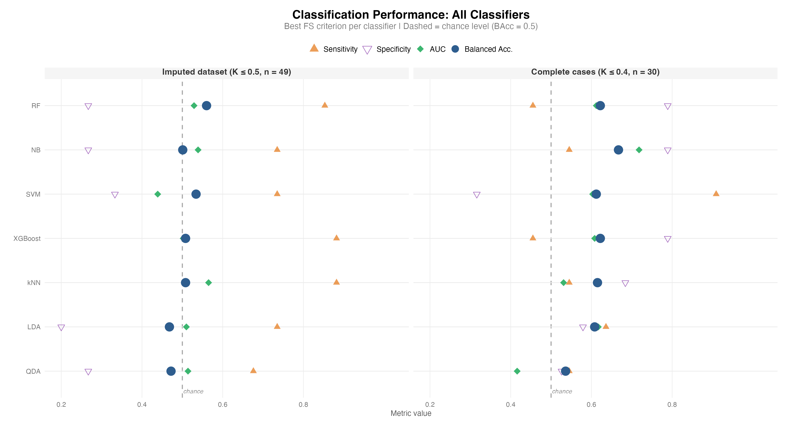
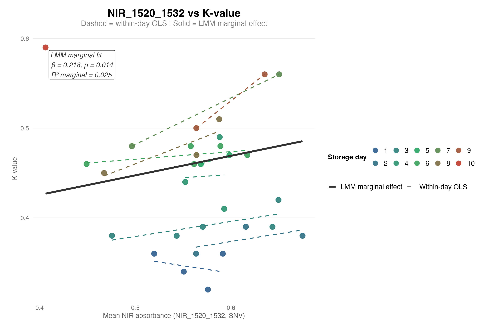

# NIR Spectroscopy for Fish Freshness Classification
## An Honest Exploratory Study

**Author:** Bernardi L.
**Data:** 49 *Sparus aurata* fillets | 140 NIR wavelengths (1350–2556 nm) | 10 storage days

---

## Project Overview

This repository contains the revised analytical pipeline for a study evaluating Near-Infrared (NIR) spectroscopy as a non-destructive freshness classification tool for gilthead seabream (*Sparus aurata*) fillets. The K-value, a ratio of ATP nucleotide degradation products, serves as the biochemical reference index.

---

## Data Engineering & Pre-processing

### Spectral Pre-processing
Raw NIR spectra (5 positions per fillet, median-aggregated) were processed in two steps:

- **Savitzky-Golay smoothing** (window = 11, polynomial degree = 2): reduces high-frequency instrumental noise while preserving spectral shape

- **Standard Normal Variate (SNV)** normalisation per sample: removes multiplicative scatter effects due to surface texture and sensor distance, ensuring detected differences reflect chemical composition rather than physical variation

### Missing Data
Chemical variables required for K-value computation (IMP, ATP, ADP, AMP, inosine, hypoxanthine) were missing for 19/49 fillets (assumed Missing at Random). **Predictive Mean Matching** (PMM, m = 10 datasets) was applied with predictors ordered by their mean absolute correlation with the chemical variables.

The optimal imputed dataset was selected algorithmically via a composite rank of three criteria:

- Kolmogorov-Smirnov distance from the observed K-value distribution

- MSE against a day-linear regression

- Frobenius norm of the inter-chemical correlation matrix difference

### Classification Thresholds

| Dataset | n | Threshold | Rationale |
|----|----|----|----|
| IMP | 49 | K ≤ 0.5 | Conventional literature boundary for *Sparus aurata* |
| REAL | 30 | K ≤ 0.4 | More conservative; corrects for unequal day distribution in complete cases |

---

## Statistical Analysis

### Classification Framework

Seven supervised classifiers were evaluated: **Naïve Bayes, LDA, QDA, k-NN, SVM (linear), Random Forest, XGBoost**.

Feature selection (AUC / ANOVA F-statistic / mRMR) was performed **within each CV fold** to prevent data leakage. The number of retained wavelengths (1–10) and all hyperparameters were tuned via inner 3-fold cross-validation. Class imbalance was addressed by minority class oversampling within each training fold.

- **IMP**: repeated 5-fold CV (10 repetitions, 50 iterations)

- **REAL**: leave-one-out CV

Decision thresholds were set via Youden's index on training probabilities.

### Permutation Testing

To avoid multiplicity, permutation testing (999 permutations) was conducted only on the **best-performing classifier per dataset**, selected a priori on balanced accuracy.

### Regression Framework

Partial correlations (NIR wavelengths vs K-value | storage day) identified spectrally informative regions independent of temporal confounding. A **linear mixed model** (LMM) was then fitted with NIR absorbance as a fixed effect and storage day as a random intercept.

---

## Results

### Classification Performance

| Classifier | Dataset | FS | BAcc | AUC | Sens | Spec | p (perm.) |
|----|----|----|----|----|----|----|----|
| **RF** † | IMP | ANOVA | **0.560** | 0.529 | 0.853 | 0.267 | 0.188 |
| SVM | IMP | AUC | 0.534 | 0.439 | 0.735 | 0.333 | — |
| NB | IMP | ANOVA | 0.501 | 0.539 | 0.735 | 0.267 | — |
| **NB** † | REAL | mRMR | **0.667** | 0.718 | 0.545 | 0.789 | **0.040** |
| RF | REAL | mRMR | 0.622 | 0.612 | 0.455 | 0.789 | — |
| SVM | REAL | AUC | 0.612 | 0.603 | 0.909 | 0.316 | — |

† Best per dataset — permutation test conducted on this model only.



---

**Key findings:**

- On complete-case data, NB_mrmr significantly exceeds chance (p = 0.040)

- On imputed data, no classifier reaches significance (best: RF_anova, p = 0.188)

- All classifiers show high sensitivity / low specificity on IMP — systematic bias toward classifying fillets as fresh

- Sensitivity analysis across 10 imputed datasets: mean BAcc 0.503–0.566 (SD 0.057–0.091) — results are sensitive to the imputation strategy

### Feature Selection Stability

**Imputed data:**

All classifiers converge on the **1440–1490 nm region** (O-H/N-H bonds, W1459/W1464), but this region is strongly correlated with storage day (r > 0.85) — likely reflecting temporal confounding rather than direct biochemical discrimination.

**Complete-case data:**

Two spectral clusters emerge by FS criterion:

- **1630–1700 nm** (C=O stretching, lipid oxidation): dominant for SVM, LDA, QDA, XGBoost (W1653: 28–59%)

- **2130–2310 nm** (C-H/C-O bonds, fatty acid esters): consistently selected by kNN, NB, RF (7–19%)

### Linear Mixed Model

Partial correlations controlling for storage day identified the **1520–1532 nm region** (protein N-H/C-H vibrations) as the only spectral region with borderline associations (W1526: r = 0.364, p = 0.052).

The final LMM confirmed a significant positive association:

```
Kvalue ~ NIR_1520_1532 + (1 | day)

β = 0.218 (SE = 0.081), t = 2.689, p = 0.014
ΔR² = 0.056 | ICC(day) = 0.93
```

A random slope for NIR was not supported (LRT: χ² = 0.727, df = 2, p = 0.695), indicating a consistent association across storage days.




## Conclusions

Three convergent lines of evidence support a genuine but weak NIR signal:

1. **Classification (REAL):** NB with mRMR feature selection achieves BAcc = 0.667, significantly above chance (p = 0.040)
2. **Feature stability:** W1653 nm (C=O lipid oxidation) consistently selected by multiple classifiers on complete-case data
3. **LMM:** The 1520–1532 nm region predicts K-value independently of storage day (β = 0.218, p = 0.014, ΔR² = 0.056)

Given the limited sample size (n = 30–49), this constitutes a **positive exploratory result** warranting further investigation with larger, more balanced datasets before conclusions on the practical applicability of NIR spectroscopy for routine freshness assessment can be drawn.

---

## Repository Structure

```
├── report_NIR.Rmd     # Full analysis report (Rmarkdown)
├── settings.R         # Global settings and package loading
├── source_all.R       # Source all custom functions
├── data/
│   ├── raw/           # Original Excel files
│   ├── intermediate/  # Preprocessed data (.rds)
│   └── results/       # Saved model outputs (.rds)
├── code/
│   ├── classifiers.R  # R6 class definitions (LDA, QDA, NB, kNN, SVM, RF, XGBoost)
│   ├── data.R
│   ├── functions.R.   # main analysis functions
│   └── plot.R         # Visualisation functions
└── plot/              # Generated figures
```

## Software

All analyses performed in **R 4.5.2**.  
Key packages: `mice`, `mlr3`, `lme4`, `lmerTest`, `MuMIn`, `ranger`, `xgboost`, `e1071`, `kknn`, `pROC`, `ggplot2`, `patchwork`, `data.table`, `R6`.